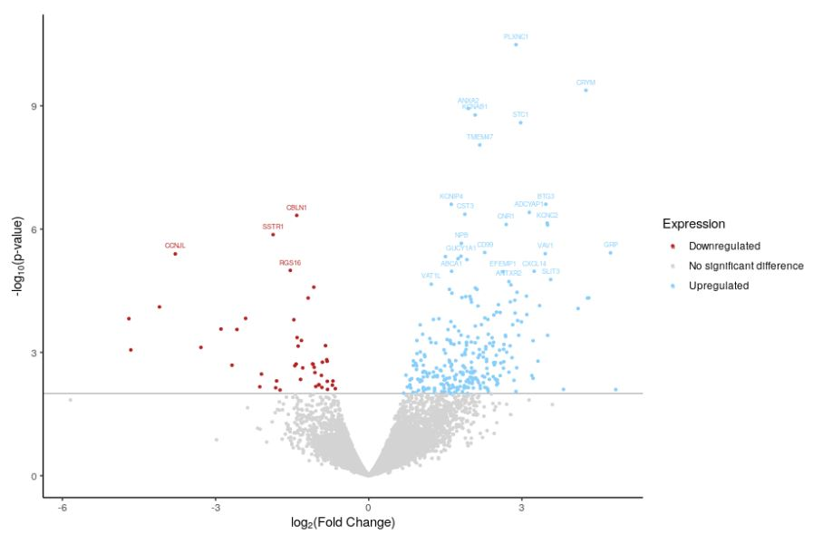
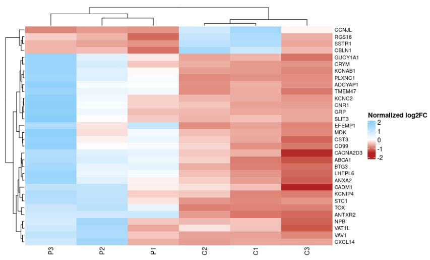
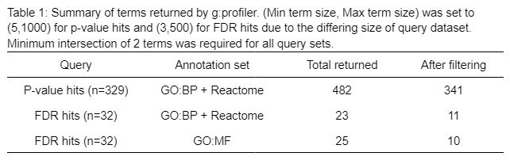

The data used in this report was obtained from the paper by Zaccaria and coworkers [@zaccaria2022multiomic]. Gene symbols in the raw data were mapped to standard HGNC symbols in a one-to-one mapping. Data for unmapped genes was discarded. One-to-many mappings were resolved by selecting one of the aliases, while many-to-one mappings were resolved by taking the arithmetic mean of affected rows.

The data was filtered to remove genes with \< 1 count-per-million expression across at least six samples and normalized using a trimmed M-means approach. The two technical replicates per sample were averaged into a single count. Overall, this yielded a processed dataset of 13174 genes across 6 samples (3 control, 3 Parkinson's) with coverage of 49.7%. This data is loaded below.

## Differential Gene Expression

Load required packages first [@robinson2010edger] [@ggplot2] [@cheatmap] [@circlize] [@gprofiler2] [@knitr][@kableExtra]

```{r message=FALSE, warning=FALSE}
# import required packages
library(edgeR)
library(ggplot2)
library(ComplexHeatmap)
library(circlize)
library(gprofiler2)
library(knitr)
library(kableExtra)
```

Normalized counts data is first read into a DGEList object.

```{r message=FALSE, warning=FALSE}
pwd <- getwd()
normData <- readRDS("~/projects/A2/normData_nocpm.rds")
DGEdata <- DGEList(normData)
```

A design for the experiment was specified with the control group set as the baseline for comparison. A negative binomial generalized linear model (GLM) was used to fit the data to match the model chosen in the original paper. While a quasi-likelihood model reduces false positive rate, the approximations used are not suited for this dataset since the dispersion is quite high to begin with (possibly a consequence of averaging the replicates), so moderation towards the global trend may not accurately capture the true gene-wise dispersion.

```{r message=FALSE, warning=FALSE}
# group samples by condition (1 = control, 2 = PD)
group <- factor(c(1,1,1,2,2,2))
cvp <- model.matrix(~group)

# calculate dispersion and fit the data using GLM
disp <- estimateDisp(DGEdata, design=cvp, robust=TRUE)
fit <- glmFit(disp)

# Find differentially expressed genes between conditions 1 and 2
diffexp <- glmLRT(fit)
```

329 differentially-expressed genes were identified at a p-value threshold of 0.01, of which 32 genes passed correction at a false discovery rate threshold of 0.01.

```{r message=FALSE, warning=FALSE}
hits <- topTags(diffexp, sort.by = "PValue", n=nrow(normData))
length(which(hits$table$PValue < 0.01))
length(which(hits$table$FDR < 0.01))
```

```{r message=FALSE, warning=FALSE}
# classify all genes based on p-value, then fold change. Genes with FDR < 0.01 will be annotated on the plot using the shownames column
classify <- rep(NA, nrow(hits$table))
showname <- rep(NA, nrow(hits$table))
for (i in 1:nrow(hits$table)){
  if (hits$table$PValue[i] > 0.01){
    classify[i] <- "No significant difference"
  } else if (hits$table$logFC[i] > 0){
    classify[i] <- "Upregulated"
  } else {
    classify[i] <- "Downregulated"
  }
  if (hits$table$FDR[i] < 0.01){
    showname[i] <- rownames(hits$table[i,])
  }
}

# bind this information to dataframe
plotthis <- cbind(cbind(hits$table, classify), showname)
```

```{r message=FALSE, warning=FALSE}
# draw the volcano plot, coloring points by up/downregulation and labelling those with FDR < 0.01 using the previousy prepared "shownames" column

# geom_hline draws a horizontal line to delineate the significance threshold
volcano <- ggplot(data=plotthis,
                  aes(x=logFC, y=-log10(PValue), colour=classify, 
                      label=plotthis$showname)) +
  scale_color_manual(values = c("firebrick", "lightgrey", "lightskyblue")) +
  geom_hline(yintercept = -log10(0.01), col = "darkgray", lwd=0.4) +
  geom_point(size = 0.8) +
  labs(x=expression("log"[2]*"(Fold Change)"), y=expression("-log"[10]*"(p-value)"), colour="Expression") +
  geom_text(na.rm = TRUE, check_overlap = TRUE, nudge_y=0.2, size=2)
volcano + theme_classic()
```

Figure 1: Volcano plot of differentially-expressed genes. Genes with p-value \> 0.01 shown in gray. Downregulated genes are colored in red and upregulated genes in blue. Genes with FDR \< 0.01 are annotated.

```{r message=FALSE, warning=FALSE}
# store gene names of top hits in vectors
tophits_fdr <- rownames(hits$table[hits$table$FDR < 0.01,])
tophits_p <- rownames(hits$table[hits$table$PValue < 0.01,])

# normalize data for heatmap following the example presented in Lecture 8
hm_matrix <- t(scale(t(normData[which(rownames(normData) %in% tophits_fdr),])))

heatmap_col <- colorRamp2(c(min(hm_matrix), 0, max(hm_matrix)), c("firebrick", "white", "lightskyblue"))

# plot the heatmap
hm <- Heatmap(as.matrix(hm_matrix), col=heatmap_col, 
              row_names_gp = gpar(fontsize=8), column_names_gp = gpar(fontsize=10), 
              heatmap_legend_param = list(title="Normalized log2FC"))
hm
```

Figure 2: Heatmap of normalized relative expression. Only genes with FDR \< 0.01 shown.

## Over-representation Analysis

Version info for annotation sources is obtained through g:profiler

```{r message=FALSE, warning=FALSE}
# GO:BP version
get_version_info(organism="hsapiens")$sources$`GO:BP`$version

# GO:MF version
get_version_info(organism="hsapiens")$sources$`GO:MF`$version

# Reactome version
get_version_info(organism="hsapiens")$sources$REAC$version
```

```{r message=FALSE, warning=FALSE}
# define a function to run g:profiler with R interface and automatically filter results
# default p-value threshold is set to 0.01, minimum intersection set to 2

runGProfiler <- function(query, thres=0.01, annotSources, tsize, imin=2){
  gprofiler_output <- gost(query, correction_method="fdr", ordered_query=TRUE,
                         user_threshold=thres, sources=annotSources)
  enriched <- gprofiler_output$result
  filtered_gs <- enriched[which(enriched$term_size>tsize[1] & 
                                  enriched$term_size<tsize[2] & 
                                  enriched$intersection_size>=imin), c(3,4,5,6,10,11)]
  cnames <- c("p-value", "T", "Q", "Intersection", "Source", "Term")
  table <- kable(filtered_gs, format="html", row.names=F, col.names=cnames)
  nofw <- kable_styling(table, full_width = F)
  column_spec(nofw, 1:6, width = "20em")
}
```

G:profiler analysis using annotation sets relating to physiological function reveal that genes associated with neural development, neuron signalling and cellular interactions with its environment are most affected. It is therefore possible that Parkinson's disease has etiological roots in the process of development and remodeling/recovery from damage.

```{r message=FALSE, warning=FALSE}
# run g:profiler for p-value hits first
runGProfiler(tophits_p, annotSources=c("GO:BP", "REAC"), tsize=c(5,1000))
```

------------------------------------------------------------------------

Limiting the genes to only those passing our FDR threshold, a markedly clearer picture is formed - genes with the most significant differences in expression are heavily involved in ion transport and synaptic signalling. Over-representation results from the molecular function gene ontology annotation set suggest that voltage-gated K+ channels are strongly implicated.

```{r message=FALSE, warning=FALSE}
# run g:profiler for fdr hits to identify enriched pathways
runGProfiler(tophits_fdr, annotSources=c("GO:BP", "REAC"), tsize=c(3,500))
```

```{r message=FALSE, warning=FALSE}
# compare to hits on molecular function annotation source
runGProfiler(tophits_fdr, annotSources="GO:MF", tsize=c(3,500))
```

------------------------------------------------------------------------

Genes associated with signalling and ion transport are upregulated in PD, while genes related to brain development are downregulated.

```{r message=FALSE, warning=FALSE}
# store upregulated and downregulated gene names in a list. Only genes passing the FDR threshold are included. 
up <- rownames(hits$table[which(hits$table$logFC > 0 & hits$table$FDR<0.01), ])
down <- rownames(hits$table[which(hits$table$logFC < 0 & hits$table$FDR<0.01),])
```

```{r message=FALSE, warning=FALSE}
# run g:profiler on each one separately to identify unique terms in each set
runGProfiler(up, annotSources = c("GO:BP", "GO:MF"), tsize=c(3,1000))
```

```{r message=FALSE, warning=FALSE}
runGProfiler(down, annotSources = c("GO:BP", "GO:MF"), tsize=c(3,1000))
```

## Answers to Questions (DE)

1.  With a p-value threshold of 0.01, 329 differentially-expressed genes were identified. This was intentionally chosen to limit hits to only the most significant genes. Since the original protocol selects genes based on adjusted p-value instead (a procedure that we will follow), choice of threshold here is somewhat less important.

2.  Following the procedure used in the original paper, the Benjamini-Hochberg method [@benjamini1995controlling] was used for multiple hypothesis correction. 32 genes passed correction at a false discovery threshold of 1%. This threshold was selected to match the criterion imposed on the p-value and is more stringent than the 5% threshold used in the original paper.

3.  Volcano plot is shown in Figure 1 (replicated below). Genes that passed correction are labelled.

    

4.  Heatmap is shown in Figure 2 (replicated below). Samples from each group do cluster together, although there are some similarities between C3 and the Parkinson's Disease samples. The most notable point of difference comes from expression of genes such as CD99, TMEM47 and ABCA1, which is higher across PD samples compared to the controls. It is likely that these differences reflect a fundamental physiological difference that cannot be accounted for by biological variation alone.

    

## Answers to Questions (Thresholded ORA)

1.  A thresholded list was used for ORA since genes with p-value \< 0.01 and FDR \< 0.01 have already been identified in the previous step. Further analysis of the most significant genes is expected reveal the pathways that are most involved in the pathogenesis of Parkinson's disease. An additional benefit of this approach is the comparatively small size of the FDR-thresholded gene set, from which individual examples can be highlighted and used for comparison against literature.

2.  <GO:BP> (updated 2024-01-17) and reactome (updated 2024-01-25) were used to identify affected biological processes since these are the two largest relevant annotation sources. <GO:MF> (updated 2024-01-17) was also used to extract molecular information data, which is useful for complementing our understanding of physiological changes associated with Parkinson's disease.

3.  Results at threshold of 0.01 are presented in table 1.

    

4.  Generally, the same genesets are identified. Separating the two aids in connecting each set to their physiological functions. The analysis shows that genes involved in neural development are downregulated, while upregulated genes are associated with synaptic signalling.

## Answers to Questions (Interpretation)

1.  The ORA identified multiple genes that were also highlighted in the original study, including CST3, CBLN1, ABCA1, BTG3 and CD99 among others, largely supporting the conclusions of the original paper [@zaccaria2022multiomic].

    For example, Zaccaria et al's paper also identified upregulation of CST3 mRNA and its protein product (cystatin C), lending credibility to their proposition that cystatin C plays a role in neurodegenerative disorders. The authors also proposed that inflammation plays a role in Parkinson's disease, which is supported by this analysis showing enrichment of immune-related genes such as CD99. While the specific genes vary, it is also notable that terms associated with GPCR signalling are enriched in the g:profiler analysis, corroborating the results of the original paper that regulators of G-protein signalling are differentially expressed.

    Similarly, a shared pattern emerges among the downregulated genes. Specifically, our analysis has highlighted CBLN1 as a gene with significant differential expression. As the original authors point out, decreased expression of CBLN1 is widely considered to be a prominent indicator of Parkinson's disease.

2.  Several of the 32 genes with FDR \< 0.01 are involved in GPCR signalling (e.g. VAV1, ADCYAP1), suggesting that dysregulation of this process may play a role in the pathogenesis of Parkinson's disease. Indeed, recent studies [@wong2023g] [@gu2021role] suggest that GPCR component upregulation is indicative of microglia activation resulting from accumulation of alpha-synuclein in Parkinson's disease.

    Another group of upregulated genes (e.g. CADM1, EFEMP1) are primarily responsible for cellular interactions with the extracellular matrix, suggesting that the brain ECM may also be implicated. A rational explanation is that ECM interactions are required for synaptic remodeling and maintenance of the overall extracellular environment. Consequently, disruptions in normal ECM homeostasis could contribute to neuronal degeneration [@rike2023proteins].

    Interestingly, Carlson and colleagues point out that significant upregulation in genes related to ion transport activity is likely independent of the disease state and results from extensive depolarization of neurons prior to brain death [@carlson2018spreading]. This suggests that it is evident that the process of obtaining human samples introduces confounding factors that must be taken into account when assessing the data.

## References
