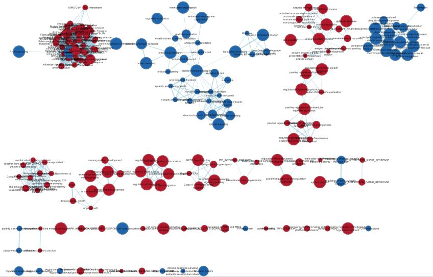
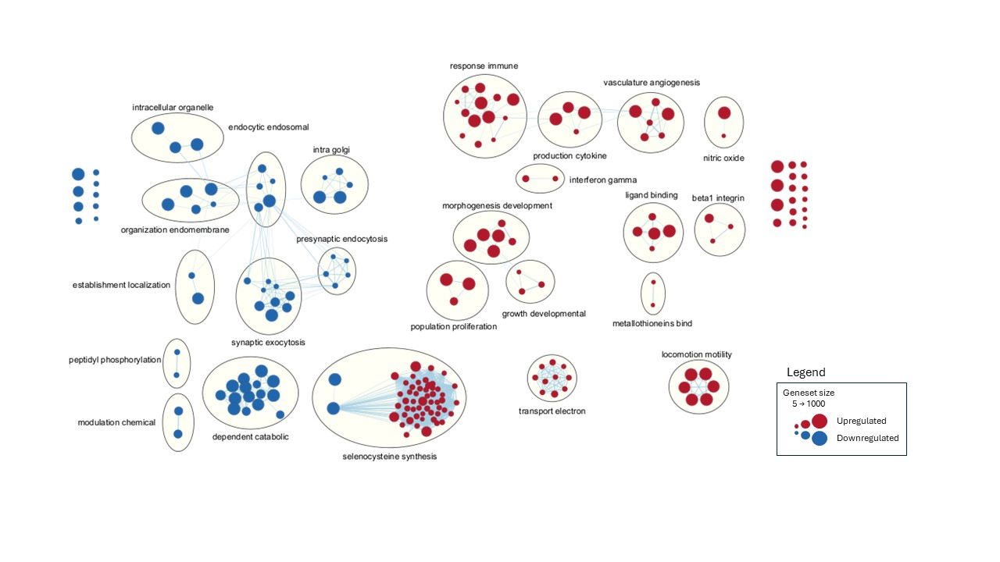
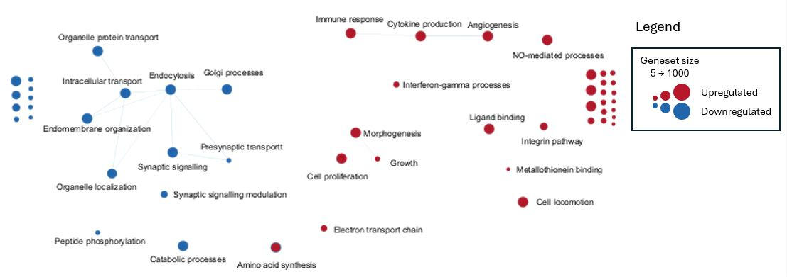
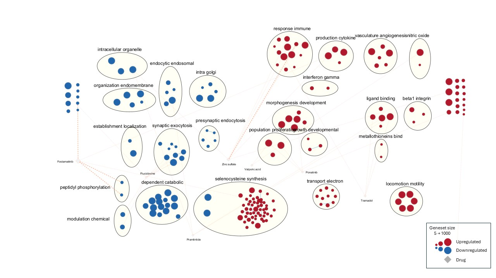

## Introduction to Dataset

Data used in this report was obtained from the paper by Zaccaria and coworkers [@zaccaria2022multiomic]. Gene names were mapped to current standard HGNC gene symbols in a one-to-one manner. Genes with \< 1 count-per-million expression across at least six samples were filtered out and the data was normalized using a trimmed M-means approach. The processed dataset consisted of 13174 genes across 6 samples (3 control, 3 Parkinson's) with coverage of 49.7%.

Thresholded over-representation analysis (ORA) was then performed using g:profiler, focusing on the G0:BP and <GO:MF> annotation sets to elucidate possible links between molecular function and physiological changes at the cell scale. Genes relating to signalling and ion transport are upregulated while processes such as brain development are downregulated.

The hits found in Assignment 2 were first processed and sorted by "combined rank", calculated as -log10(pvalue) x log2(fold change). The following code is from assignment 2.

```{r message=FALSE, warning=FALSE}
library(edgeR)
pwd <- getwd()
normData <- readRDS("~/projects/A2/normData_nocpm.rds")
DGEdata <- DGEList(normData)
# group samples by condition (1 = control, 2 = PD)
group <- factor(c(1,1,1,2,2,2))
cvp <- model.matrix(~group)

# calculate dispersion and fit the data using GLM
disp <- estimateDisp(DGEdata, design=cvp, robust=TRUE)
fit <- glmFit(disp)

# Find differentially expressed genes between conditions 1 and 2
diffexp <- glmLRT(fit)
hits <- topTags(diffexp, sort.by = "PValue", n=nrow(normData))
```

```{r message=FALSE, warning=FALSE}
options(scipen=200) # suppresses scientific notation
out <- hits$table
out$names <- rownames(out)
out$rank <- -log10(out$PValue)*out$logFC
out <- out[,c(6,7)]
colnames(out) <- c("GeneNames", "rank")
out <- out[order(out$rank, decreasing=TRUE),]
write.table(out, file="~/projects/rank_combined.rnk", sep="\t", row.names=FALSE, quote=FALSE)
```

## Non-thresholded GSEA

The following code can be used to run GSEA through R when uncommented. However, it was found that fgsea produced different results from GSEA v4.3.3, including p-values that differed despite using identical settings. Consequently, this approach was not used for further analysis.

```{r message=FALSE, warning=FALSE}
library(fgsea)
library(RCy3)
set.seed(20240328)
```

```{r message=FALSE, warning=FALSE}
preranked <- read.table("~/projects/rank_combined.rnk",
                    header=TRUE, colClasses = c("character", "numeric"))
ranks <- preranked$rank
ranks <- setNames(ranks, preranked$GeneName)
gmtfile <- "~/projects/Human_GOBP_AllPathways_noPFOCR_no_GO_iea_March_01_2024_symbol.gmt"
```

```{r message=FALSE, warning=FALSE}
GSEA = function(preranked, gmtfile){
    genesets <- gmtPathways(gmtfile)
    GSEA_results <- fgseaSimple(pathways = genesets, stats = preranked, gseaParam=0,
                                nperm=1000, minSize=5, maxSize=1000)
    GSEA_df <- as.data.frame(GSEA_results)
  return(GSEA_df)
}
```

```{r message=FALSE, warning=FALSE}
# GSEA_out <- GSEA(ranks, gmtfile)
# length(which(GSEA_out$ES > 0 & GSEA_out$pval < 0.01))
```

## Answers to Questions (Non-thresholded GSEA)

1.  Preranked GSEA was run with the <GO:BP> (no PFOCR, no IEA, Mar 1 2024 version) genesets from the Bader Lab repository. Genes were ranked by a combined score, which was calculated as -log10(p-value)\*log2(FC).
2.  5388 genesets were upregulated in Parkinson's disease, of which 460 had a nominal p-value \< 0.01. The most enriched genesets included interferon-gamma response, immune response, GPCR ligand binding and peptide ligand-binding receptors. 4883 genesets were downregulated, of which 303 passed the p-value filter of 0.01. The downregulated pathways included trans-synaptic signalling, vesicle-mediated transport and membrane trafficking.
3.  Several enriched genesets are broadly similar to those identified from ORA, for example synaptic signalling and transport. However, many of the genesets with highest normalized enrichment score in GSEA were not identified during ORA. This is not a straightforward comparison since the ORA results are derived from a filtered list of genes with p-value \< 0.01 and thus correspond to individual strong signals. On the other hand, many of the GSEA hits were not detected during ORA likely because multiple involved genes were upregulated but none yielded a sufficiently strong signal.

## Answers to Questions (Enrichment map)

1.  There are 199 nodes and 1685 edges in the resulting map (Figure 1). The map was generated with default thresholds (FDR q-threshold = 0.01, node cutoff of q=0.01, edge cutoff of 0.375)

    

2.  The entire network was annotated with MCL cluster algorithm (edges weighted by similarity coefficient). Clusters were drawn to prevent overlap. Labels were restricted to 2 words each.

3.  Publication-ready figure was produced by annotation of figure 1, followed by manual layout. Clusters with similar physiological functions were positioned in proximity with each other. A legend was manually added for clarity.

    

4.  The major themes in upregulated genes include immune response and growth, which were both identified in ORA as well. These fit in well with the etiological model presented in the original paper, where inflammation and impaired cellular turnover are major contributing factors of Parkinson's disease (PD). Intracellular protein trafficking and synaptic signalling appear to be the major theme on the downregulated side. Intracellular protein localization is known to be dysregulated in PD patients and thus broadly agrees with the existing model. Interestingly, processes related to amino acid synthesis were broadly upregulated with the exception of RNA metabolism, which was not evident during either ORA or GSEA.

    

## Answers to Questions (Interpretation)

1.  The enrichment map strongly supports conclusions from the original paper[@zaccaria2022multiomic], which highlights the role of inflammation and dysregulation of protein transport as contributing factors to PD. One pathway that was not obvious from the ORA in assignment 2 is metallothionein binding, which has neuroprotective effects and was also found to be upregulated in the original paper.

    The role of extracellular matrix interactions is not as pronounced in this analysis, likely because ECM homeostasis is controlled by genes also involved in growth and proliferation. Another group of genes prominently missing from the enrichment map is GPCR signalling-related genes, possibly because the individual receptor-related genes that were detected by ORA were upregulated as part of a different physiological pathway.

2.  Impaired protein catabolism has been established to be a cause of Parkinson's disease, resulting in the formation of protein aggregates in neurons [@bi2021expanding]. The formation of protein filaments and Lewy bodies in neurons has been cited as a cause for neuronal death in the substantia nigra [@gundersen2010protein].

    Interestingly, amino acid synthesis has in fact been reported to be upregulated in PD patients [@gatarek2022plasma]. However, the reason for upregulation can be distinct for each amino acid. Large amino acids such as tyrosine and phenylalanine are precursors to signalling molecules such as dopamine[@gatarek2022plasma], which must be synthesized in higher amounts by PD patients due to destruction of the substantia nigra. Other amino acids, for example methionine, are synthesized to protect against oxidative stresses from the inflammatory process. Dysregulation of amino acid levels at a systemic level due to gut microbiota dysfunction may also contribute to metabolic imbalances, requiring transcriptomic adjustments to maintain homeostasis [@zhang2022plasma].

3.  Post-analysis was conducted using annotations from Human Drug Bank. A Mann-Whitney two-sided test with 0.01 cutoff was used to select genes, yielding 22 signature nodes. Only drugs with potential therapeutic function were retained. The post-analysis supports results from literature showing that some drugs may actually cause or worsen Parkinson-like symptoms, for example tramadol [@singh2019tramadol]. Many of the drugs identified could help treat PD symptoms but are generally unable to resolve the root cause (neurodegeneration). This is apparent through the network, where most of the identified therapeutics are strongly linked to single clusters. Drugs with cross-cluster edges are promising as potential treatment options. The best example of this is pramlintide, which affects both amino acid synthesis and intracellular protein trafficking. Pramlintide has been reported to inhibit amyloid fibril formation in rats [@wang2015analysis].

    

## References
